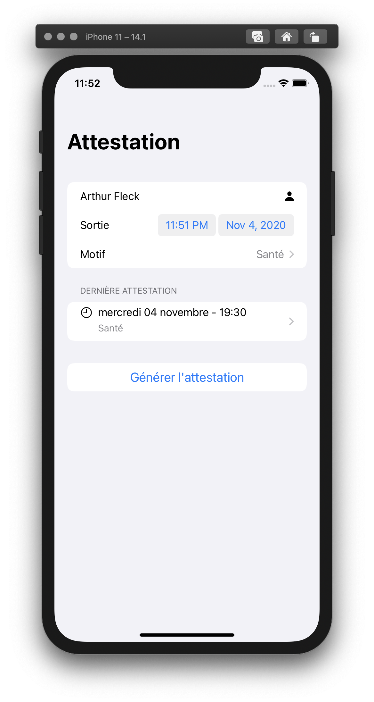
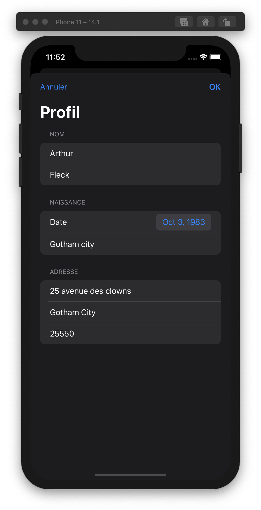
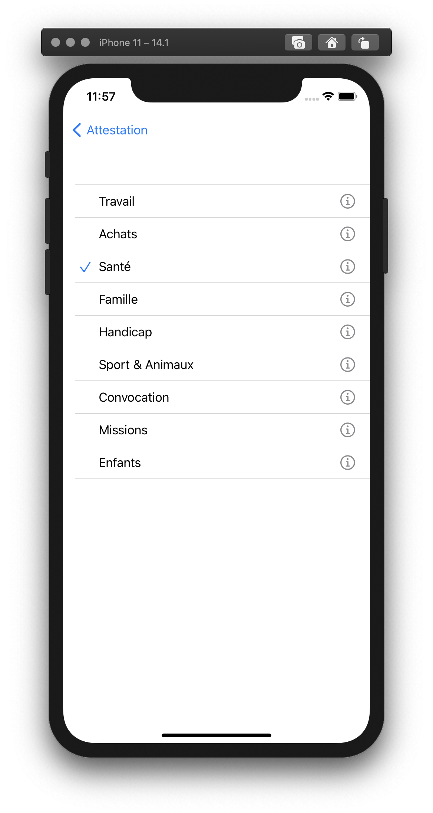
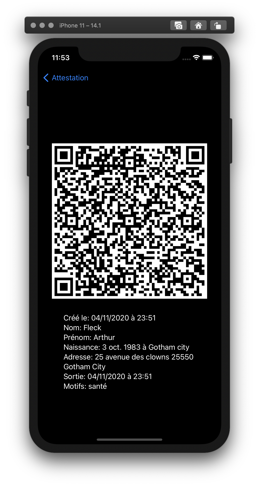

**Disclaimer**

Attestation is **non official** application to generate exit attestations during the lockdown in France. It was developed as a side project to play with SwiftUI. Should you have any legal problem by using it, the developer(s) decline(s) all responsibility.

## Features
- Store your profile to use it when generating an attestation
- Use your last exit reason by default

### Roadmap
As the application will loose any relevance once the lockdown will be over, those features will be added when the developer(s) have the time and the will to work on them 😃
- Widget to display the last attestation informations
- Widget to generate an attestation for an exit reason
- Widget to display the last attestation QR code

(And maybe... maybe!):
- Several profiles/attestation management (might be useful with children)

### Screenshots

### Contact

If you have a feature request, please let me/us know:
- [mail](alexis1bridoux@gmail.com)
- Woody on [Swift baguette](https://communityinviter.com/apps/swift-baguette/inviteme) slack
- [@Bigby_Woody](https://twitter.com/Bigby_Woody) on Twitter.